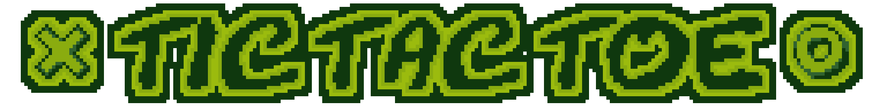
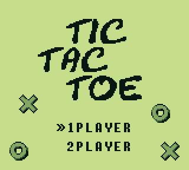
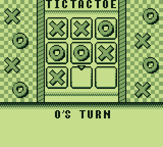
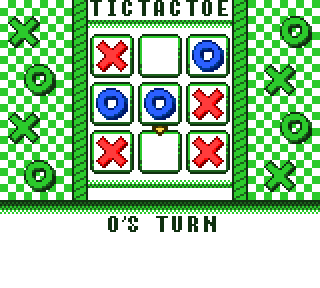

A small starter project as a first proper Gameboy game written 100% in assembly, released in 2020.

Currently the game supports two game modes: an "alternating" 2 player mode, meaning that two players take turns on the same console, as well as a singleplayer mode against an AI.

Support for a Link-Cable-based multiplayer mode is planned.

The game fully supports Gameboy Color features, but also runs perfectly fine on a non-color Gameboy version.

# Credits

All code and graphics written/created by [Hacktix](https://github.com/Hacktix). Makefile created by [JL2210](https://github.com/JL2210).

Extra thanks to the [Emulator Development Discord](https://discord.gg/7nuaqZ2) as well as the [gbdev Discord](https://discord.gg/gpBxq85) for helping with and providing feedback during development.

# Screenshots

**Title Screen:**

**Gameplay:**

**Gameboy Color Support:**

